# DashBite — living plan

## Base — Pipeline diagram

```mermaid
flowchart LR
    subgraph simulator[Simulator process]
        S[Create sample orders<br/>and observed was_late labels]
    end
    S -->|data/raw/orders.csv<br/>order_id, timestamp, distance_km,<br/>prep_minutes, order_value, was_late| RAW[(data/raw/)]

    subgraph preprocess[Preprocess process]
        P[Validate schema and types<br/>prepare consistent records]
    end
    RAW --> P
    P -->|data/processed/orders.csv| PROCESSED[(data/processed/)]

    subgraph train[Training process]
        T[Fit and evaluate late-order model<br/>using labeled records]
    end
    PROCESSED --> T
    T -->|data/models/model-vNNN.pkl<br/>versioned checkpoint| MODELS[(data/models/)]
    T -->|data/reports/training_metrics.json<br/>evaluation scores and model version| TRAINING_REPORT[(data/reports/)]

    subgraph infer[Inference process]
        I[Load newest checkpoint already on disk<br/>predict late risk per order]
    end
    PROCESSED --> I
    MODELS -.->|independent read; training need not be running| I
    I -->|data/predictions/predictions.csv<br/>order_id, timestamp, predicted_late, late_probability| PREDICTIONS[(data/predictions/)]

    subgraph pulse[Model Pulse dashboard]
        D[Read-only presentation<br/>no pipeline execution or fitting]
        V[Show sample volume over time<br/>from order timestamps]
        Q[Show observed late-order rate<br/>from labeled raw orders]
        R[Show model quality and version<br/>from training report]
        H[Show predicted late risk<br/>from inference output]
    end
    RAW -.->|read-only: timestamp, was_late| V
    RAW -.->|read-only: observed outcomes| Q
    TRAINING_REPORT -.->|read-only| R
    PREDICTIONS -.->|read-only| H
    V --> D
    Q --> D
    R --> D
    H --> D
```



Stages behave like separate processes and exchange data through `data/` files, not Python imports. Preprocessing hands the same prepared records to two independent consumers:

- **Simulator:** creates sample orders with the small raw schema and observed outcomes for the demo.
- **Preprocess:** checks and normalizes incoming records, then publishes the prepared dataset for downstream use.
- **Train:** fits and evaluates a model from labeled prepared records, publishes a new versioned checkpoint, and writes evaluation metrics plus its model version to `data/reports/training_metrics.json`.
- **Infer:** predicts from prepared order features and writes per-order predictions to `data/predictions/predictions.csv`. It reads the newest checkpoint already present in `data/models/`; it never calls or waits for training. If training is stopped or unavailable, inference can still use a previously published checkpoint.
- **Model Pulse:** reads existing files only. It does not trigger stages, fit models, or become a dependency of training or inference.

Raw order fields stay intentionally small: `order_id`, `timestamp`, `distance_km`, `prep_minutes`, `order_value`, and `was_late`.

## Base — Teaching beats

- Treat each stage as a small process with a clear file input and output; folders are the contract between stages.
- Separate training from inference: publish versioned checkpoints, and let inference use the newest checkpoint that exists, even when training is down.
- Keep Model Pulse read-only and separate from pipeline execution.
- The Makefile is the public interface and the way we orchestrate every class demo and smoke test. Use targets such as `make simulator`, `make preprocess`, `make train`, `make infer`, `make dashboard`, and `make run`; keep implementation commands behind those targets.
- Keep the demo deliberately local and understandable: plain Python plus files, with no containers, Kafka, or Spark.

## Manual Smoke Tests

Run the end-to-end demo through the public orchestration interface:

```bash
make install
make test
make run
make dashboard
```

With a checkpoint already published, check inference independently of training:

```bash
make infer
make dashboard
```

Operational targets to provide as the pipeline is built include `make stop` and `make clean-data`. Keep these smoke tests on Makefile targets; add a target before documenting any one-off command needed by the demo.

## Model Pulse Dashboard

Model Pulse is a read-only view over files already produced by the pipeline. It must not trigger stages, fit models, or own pipeline logic.

It consumes:

- `data/raw/orders.csv` for timestamped sample volume and observed late outcomes.
- `data/reports/training_metrics.json` for evaluation metrics and the model version used.
- `data/predictions/predictions.csv` for each order's predicted late status and late probability.

Show a small set of claim-first views: sample count over time as a time-series (not only a total), observed late-order rate, model quality and version, and predicted late-risk distribution or highest-risk orders. Each chart should tell one story, with an active title and human-readable labels. Show a clear empty or stale-data state when an expected output is missing rather than running pipeline logic to create it.

## Stage 0 — Configuration and data paths

### Goal

Establish the smallest reusable project foundation: environment-overridable configuration, stable helpers for the pipeline's data directories, and a pytest structure for future stages.

### Proposed changes

- Add `pipeline/config.py` with `load_config()`. Defaults include `TRAIN_EVERY_N_EVENTS=2000` and `BATCH_SIZE=50`; read same-named environment variables as overrides and reject invalid non-positive integer values with a clear error.
- Add `pipeline/paths.py` with helpers to resolve `data/raw`, `data/features`, `data/models`, `data/predictions`, and `data/quality` from the repository root, plus `ensure_data_dirs()` to create and return a name-to-path mapping for those directories.
- Add a root `Makefile` with at least `install`, `test`, and `foundation-smoke` targets. `foundation-smoke` prints `load_config()` and each directory returned by `ensure_data_dirs()`, including whether it exists after creation.
- Add `pytest.ini` registering `unit`, `regression`, and `integration` markers, with tests organized under `tests/unit/`, `tests/regression/`, and `tests/integration/`.

### Architecture / boundaries

- Keep configuration and path resolution in small, independent `pipeline` modules; no stage-to-stage imports, services, containers, or external infrastructure.
- Resolve paths from the project root rather than the caller's current working directory. Path helpers may create the specified data directories, but configuration loading must not create files or directories.
- Read configuration from the environment at `load_config()` time so defaults remain explicit and overrides are testable; keep the two required event/batch defaults stable.
- Use the Makefile as the public interface for installation, automated tests, and the live smoke demo.

### Automated tests

- Unit: verify both defaults, each environment override, invalid values, repository-root path resolution, and directory creation/idempotence.
- Regression: lock the exact five managed directory names and the required defaults so later stages do not silently change the foundation contract.
- Integration: load configuration and create all data directories together; verify returned paths exist and remain rooted in the repository when invoked from another working directory.
- Register and apply the `unit`, `regression`, and `integration` pytest markers to their corresponding test modules; `make test` runs the full suite.

### Manual Smoke Test

#### What we're proving

The public Make target loads and prints the configuration, honors an environment override, then creates the five data directories if needed and prints their resolved paths and existence. It does not run pytest or start a pipeline stage.

#### Terminal

```bash
make foundation-smoke
TRAIN_EVERY_N_EVENTS=25 make foundation-smoke
```

The `foundation-smoke` Make target should run the equivalent of this short Python check:

```makefile
foundation-smoke:
    python -c 'from pipeline.config import load_config; from pipeline.paths import ensure_data_dirs; config=load_config(); paths=ensure_data_dirs(); print("Config:", config); print("Ensured data directories:"); print("\n".join(f"  {name}: {path} (exists={path.is_dir()})" for name, path in paths.items()))'
```

#### Watch for

The config output shows `train_every_n_events=2000` and `batch_size=50` on the first run; the second shows `train_every_n_events=25`. Both runs print all five resolved paths with `exists=True`, confirming those directories are on disk. This foundation stage does not produce CSV or model artifacts; add readable CSV/model checks to later stages' smoke tests once those outputs exist.

#### Stop

No long-running process is started; the target exits when the paths have been printed.

## Stage 1 — Synthetic order simulator

### Goal

Make the raw-data side of DashBite feel active by continuously generating synthetic food-delivery orders and publishing visible CSV batches for later stages to consume.

### Proposed changes

- Add `pipeline/simulator.py` as the module implementation, runnable as `python -m pipeline.simulator` for development and integration tests. Students launch the classroom demo through `make simulator`, not by invoking the module directly. Use `load_config()` for the configured batch size and get the effective raw output path from Stage 0's shared path/config interface (for example, `resolve_data_dir("raw")`). That shared interface owns the configurable raw location, defaulting to `data/raw`; do not construct or assume a fixed path inside the simulator.
- Write each batch as a new, timestamped CSV under `data/raw/`, with exactly these columns in this order: `order_id`, `timestamp`, `distance_km`, `prep_minutes`, `order_value`, `was_late`.
- Log a clear message such as `New orders arrived` with the batch size and output filename after each write. Run continuously by default; support `--once` and `--output-dir` options for deterministic integration testing in a temporary directory.
- Publish each CSV atomically: write to a temporary sibling file, close it, then rename it to the final timestamped filename. On Ctrl+C or a write failure, remove the temporary file and do not leave a partial final CSV.
- Add a `simulator` target to the root Makefile that runs `$(PYTHON) -m pipeline.simulator`.
- Add focused simulator tests under the existing `tests/unit/`, `tests/regression/`, and `tests/integration/` layout.

### Architecture / boundaries

- The simulator is a standalone process. It imports only shared configuration/path helpers and standard-library generation/writing utilities; it does not import preprocessing, training, inference, or dashboard code.
- Write raw records only to the effective raw directory returned by the shared path/config interface. Preserve the six-column raw schema; values may include imperfect records for the later preprocessing stage to handle.
- Generate a distinct file for each batch so students can see new files arrive and inspect a complete batch without reading a file that is still being written.
- Handle Ctrl+C cleanly: stop the loop, remove any in-progress temporary file, preserve already completed batches, and exit without publishing a broken or partial CSV. The Makefile is the public classroom interface; students should use `make simulator`, while direct module invocation is for development and automated integration tests only.

### Automated tests

- Unit: generated batches use the configured size, have unique order IDs, and contain the six required fields with serializable timestamps and late labels.
- Regression: assert the exact CSV column names and order, and that each batch is written as a distinct CSV beneath the raw data directory.
- Integration: run the module in one-batch mode against a temporary output directory; verify it exits, emits the arrival log, and writes a readable CSV with the expected schema and row count. Verify a configured raw-path override is honored, and interruption during a batch leaves no partial final CSV or temporary file while completed batches remain readable. Mark tests `unit`, `regression`, and `integration` respectively; run them through `make test`.

### Manual Smoke Test

#### What we're proving

The Makefile starts a live simulator process, each completed batch produces an inspectable raw CSV in `data/raw`, and new arrival logs and files continue appearing independently of downstream stages. Direct development runs may use `--output-dir` to write elsewhere; the Make target uses the shared raw-directory resolver.

#### Terminal

Terminal 1, start the continuous simulator:

```bash
make simulator
```

Terminal 2, after the first arrival log appears in Terminal 1, inspect the output directory and the newest batch:

```bash
ls -lh data/raw
latest=$(ls -t data/raw/*.csv | head -n 1)
head -n 5 "$latest"
```

Repeat the Terminal 2 commands to see later batch files and inspect another CSV.

#### Watch for

Terminal 1 repeatedly prints `New orders arrived` with a filename. Terminal 2 shows timestamped CSV files appearing in the configured raw directory; the CSV header is `order_id,timestamp,distance_km,prep_minutes,order_value,was_late`, followed by readable sample rows. Pressing Ctrl+C during generation stops cleanly: completed batches remain readable and no partial final CSV or temporary file is left behind.

#### Stop

Press Ctrl+C in Terminal 1 to stop the simulator loop. It should report a clean stop and leave completed CSV batches intact without an incomplete batch file.

## Stage 2 — Order preprocessing and feature engineering

### Goal

Turn incoming raw order batches into clean, model-ready feature CSVs while preserving the observed late label for supervised training.

### Proposed changes

- Add `pipeline/preprocess.py` as an independent module. Read finalized CSV batches from the shared raw path and write feature batches to the shared `features` path using Stage 0 path helpers.
- Define invalid rows explicitly: `order_id` is missing or blank; `timestamp` is not a parseable ISO-8601 timestamp with an explicit timezone; `distance_km` or `prep_minutes` is missing, nonnumeric, non-finite, or less than or equal to zero; `order_value` is missing, nonnumeric, non-finite, or negative; or `was_late` is missing or not a case-insensitive `true`/`false` or `1`/`0` value. Reject the whole row if any required field is invalid, and log input, accepted, and rejected row counts.
- Derive `hour` as the UTC hour from `timestamp` and `is_peak` as a Boolean that is true for hours 11–13 and 17–20 UTC. Preserve the meaning of `was_late` as the target label, canonicalizing accepted values to Boolean `True`/`False`; preserve the other valid source fields alongside the two features.
- Write one feature CSV per raw input, named to retain its source batch identity, with the columns `order_id`, `timestamp`, `distance_km`, `prep_minutes`, `order_value`, `was_late`, `hour`, `is_peak`.
- Poll for new raw batches continuously by default, skip batches already processed, and support a one-pass option for deterministic tests. Add `make preprocess` to run `$(PYTHON) -m pipeline.preprocess`; students use the Make target rather than invoking the module directly.

### Architecture / boundaries

- Keep preprocessing a separate process. It reads and writes through the shared `data/raw/` and `data/features/` paths; it does not import or call simulator, training, inference, or dashboard stage logic.
- Discover only finalized `orders_*.csv` inputs; ignore temporary names such as `.*.tmp`. Before opening a candidate, require its size and modification time to remain unchanged across two polls. This guards against files still being written, even if a producer exposes a `.csv` before finishing it.
- Publish each feature CSV through a temporary sibling file and atomically rename it only after the full batch is written. A final feature file is the completion marker; skip that input on later polls. On a per-file read, validation, or write exception, log the source filename and error, remove any temporary feature output, leave the raw input untouched, and retry it on the next poll. Continue processing other batches rather than stopping the watcher.
- Keep the source batch identity in the feature filename so outputs can be traced back to their raw inputs and repeated polling is idempotent.
- Make timestamp timezone requirements, numeric bounds, accepted `was_late` representations, UTC hour, and peak-hour windows (11:00–13:59 and 17:00–20:59 UTC) explicit and stable in code/tests. Keep `was_late` as the target label; do not use it to derive features.

### Automated tests

- Unit: test blank IDs; malformed or timezone-naive timestamps; missing, nonnumeric, non-finite, zero, and negative distances/prep times; negative or non-finite order values; accepted boolean spellings and invalid/missing labels; verify valid rows retain source values, labels keep their meaning, and `hour`/`is_peak` are correct at boundary hours.
- Regression: assert the exact output column names/order, UTC hour behavior, stable peak-hour boundaries, and source-linked feature filenames.
- Integration: verify a changing or temporary raw file is ignored until it is finalized and stable; feed a finalized temporary raw batch through one-pass mode and verify a readable feature CSV with only valid rows, preserved `was_late`, and expected derived values. Verify repeated polling does not duplicate completed output; inject a per-file failure and confirm its temporary feature file is removed, the raw input remains retryable, later batches still process, and no partial final CSV appears. Mark tests `unit`, `regression`, and `integration` respectively and run them through `make test`.

### Manual Smoke Test

#### What we're proving

Orders flow across stage boundaries as files: the simulator publishes raw CSV batches, preprocessing notices them and writes cleaned feature CSVs, and the classroom can inspect the derived `hour`, `is_peak`, and preserved `was_late` columns.

#### Terminal

Terminal 1, start the simulator:

```bash
make simulator
```

Terminal 2, start the preprocessing watcher:

```bash
make preprocess
```

Terminal 3, inspect the raw and generated feature files after preprocessing logs a completed batch:

```bash
ls -lh data/raw data/features
latest=$(ls -t data/features/*.csv | head -n 1)
head -n 5 "$latest"
```

#### Watch for

Terminal 1 logs new order batches and raw CSVs appear under `data/raw/`. Terminal 2 logs each batch processed and its accepted/rejected row counts; corresponding feature CSVs appear under `data/features/`. The inspected feature CSV includes `hour`, `is_peak`, and the original `was_late` label.

#### Stop

Press Ctrl+C in Terminal 2 to stop preprocessing, then Terminal 1 to stop the simulator. Both processes should exit cleanly; completed raw and feature CSVs remain readable.

## Stage 3 — Logistic regression training

### Goal

Train a first late-order classifier from the cleaned feature files and publish a versioned model artifact plus a small metrics sidecar to disk.

### Proposed changes

- Add `pipeline/train.py` as an independent module that reads completed `*_features.csv` files from the shared features path and writes artifacts under the shared models path.
- Fit `sklearn.linear_model.LogisticRegression` using exactly `distance_km` and `prep_minutes` as input features and `was_late` as the binary target. Do not include `hour`, `is_peak`, IDs, or timestamps in the model inputs.
- Use `TRAIN_EVERY_N_EVENTS` as the training threshold: publish initially when at least that many valid labeled events are available, then retrain after each additional threshold-sized set of new events. Use the latest successful sidecar's recorded feature-batch IDs as the restart checkpoint; count rows only from completed feature batches whose IDs are not already recorded. After the threshold is reached, fit/evaluate on the complete set of available batches. If the threshold is reached but there is not enough data to represent both label classes in training and evaluation, log that training is waiting for more data and do not publish a model.
- Separate evaluation from fitting with a deterministic stratified 80/20 train/test split (`random_state=42`), keeping `was_late=True` as the positive class. Report test-set accuracy, precision, recall, F1, and ROC-AUC; after evaluation, fit the published checkpoint on all available feature rows.
- Publish monotonically versioned joblib checkpoints such as `late_order_v0001.joblib` with matching `late_order_v0001.metrics.json` sidecars under `data/models/`. Include the model version, training timestamp, total event count, target class counts, exact feature-batch IDs included, split sizes/seed, and the named evaluation metrics in the sidecar.
- Add `make train` to run `$(PYTHON) -m pipeline.train`; use shared configuration and path helpers, and add `scikit-learn` and `joblib` to `requirements.txt` if they are not already available through declared dependencies.

### Architecture / boundaries

- Training reads cleaned feature files and publishes model artifacts only. It does not import, call, start, or wait for inference; it has no dependency on inference availability.
- Run as a separate process that polls the features directory for complete feature batches and logs when it is waiting, reaches its event threshold, or publishes a model. `make train` is the classroom-facing entry point.
- Use each immutable feature filename as its batch ID; persist the included batch-ID set and row counts in the sidecar. On restart, compare discovered batch IDs with the latest successful sidecar and count only unseen batches toward the next threshold, so the same rows are never counted again.
- Write checkpoint and sidecar to temporary files first, then publish completed files atomically; do not overwrite prior model versions. Keep the sidecar version paired with its checkpoint and use only successfully published sidecars as restart state.

### Automated tests

- Unit: verify the estimator is LogisticRegression with exactly `distance_km` and `prep_minutes`, `was_late=True` is the positive class, the deterministic stratified split has no train/test overlap, all five test metrics are computed, and insufficient class coverage delays publication.
- Regression: assert versioned checkpoint/sidecar naming, monotonically increasing versions, required provenance and metric fields, stable split seed/ratio, and that earlier checkpoints are never overwritten.
- Integration: provide temporary cleaned feature batches and a small `TRAIN_EVERY_N_EVENTS`; verify no publication occurs below threshold, then verify a readable joblib checkpoint and matching metrics JSON are published after the threshold. Restart with the same batches and verify their rows are not recounted; add a new batch and verify only its rows advance the threshold. Also verify a failed publication leaves no partial final artifact. Mark tests `unit`, `regression`, and `integration` respectively and run through `make test`.

### Manual Smoke Test

#### What we're proving

The classroom drives orders through the existing Make targets and sees the training process publish a versioned model and metrics sidecar to disk. This stage stops at model publication; it does not run inference.

#### Terminal

Terminal 1, keep synthetic orders arriving:

```bash
make simulator
```

Terminal 2, keep converting raw batches into labeled feature files:

```bash
make preprocess
```

Terminal 3, start training with a small event threshold so the classroom demo publishes quickly:

```bash
TRAIN_EVERY_N_EVENTS=25 make train
```

Terminal 4, after the training log reports a publication, inspect the artifact and sidecar:

```bash
ls -lh data/models
metrics=$(ls -t data/models/*.metrics.json | head -n 1)
cat "$metrics"
```

#### Watch for

Terminal 3 reports the event threshold and then `Training published an artifact to disk` with the checkpoint and sidecar names. Terminal 4 shows a versioned `.joblib` file and matching `.metrics.json` with included feature-batch IDs, event and class counts, split details, version, timestamp, and test-set accuracy, precision, recall, F1, and ROC-AUC.

#### Stop

Press Ctrl+C in Terminal 3 to stop training, then Terminal 2 to stop preprocessing, then Terminal 1 to stop the simulator. Completed feature files and published model artifacts remain on disk. Do not start inference in this smoke test.

## Stage 4 — Independent inference consumer

### Goal

Consume cleaned feature batches and the newest published model checkpoint to produce inspectable late-order predictions, with no runtime dependency on the training process.

### Proposed changes

- Add `pipeline/infer.py` as an independent module and `make infer` as its classroom-facing entry point. It scans completed `*_features.csv` batches and writes prediction batches under the shared predictions path.
- Discover checkpoint/sidecar pairs in the shared models path in descending version-number order (for example, `late_order_v0003.joblib`), not by modification time. A candidate is usable only when its matching sidecar is complete and consistent and the checkpoint deserializes and exposes the expected feature order and scoring interface. If the newest candidate is incomplete, mismatched, or corrupted/unloadable, log that version's failure and safely try the next newest usable checkpoint; wait without scoring only when no usable checkpoint remains.
- Load the checkpoint with joblib and score exactly `distance_km` and `prep_minutes`, in the feature order recorded by training. Use the probability for the positive `was_late=True` class as `late_probability`, and classify `predicted_late` as true at probability `>= 0.5`.
- Write one prediction CSV per feature batch under `data/predictions/`, named by replacing the feature filename suffix `_features.csv` with `_predictions.csv`. Include exactly these columns in order: `order_id`, `late_probability`, `predicted_late`, `checkpoint_id`. Set `checkpoint_id` to the model version used (for example, `v0003`).
- Log which checkpoint was loaded and when a feature batch is scored. If no complete checkpoint/sidecar pair exists, log that inference is waiting and keep polling; do not touch or mark feature batches as processed until a checkpoint is available. Support one-pass mode for deterministic tests.

### Architecture / boundaries

- Inference is a separate consumer of files. It may import shared path helpers and joblib/scikit-learn interfaces, but must never import or call `pipeline.train`, trigger training, or wait for the training process.
- Before scoring each new feature batch, resolve and validate checkpoint pairs newest-to-oldest, falling back to the newest complete, loadable, compatible checkpoint if a later version is incomplete or corrupted. This lets a running inference process pick up newer published versions, while continuing to work from a valid existing checkpoint when training is stopped or the newest publication is damaged.
- Treat the final prediction filename as the completion marker: skip a feature batch that already has a complete prediction output. Write outputs to a temporary sibling and atomically rename after the full CSV is written; failed scoring must leave no partial final output and must allow retry.
- Keep the prediction schema limited to the requested four columns. Use the input feature batch identity in the output filename so predictions can be traced to their source.

### Automated tests

- Unit: verify newest-version selection ignores incomplete/temp artifacts and falls back when the highest version is corrupted, mismatched, or unloadable; scoring uses the trained feature order, `late_probability` comes from the positive class, the 0.5 threshold determines `predicted_late`, and each output row contains the correct `checkpoint_id`.
- Regression: assert the exact prediction columns/order, output-to-feature filename mapping, and that checkpoint selection is by version number rather than modification time, with fallback when the newest version is unusable.
- Integration: with no checkpoint, verify inference logs that it is waiting and writes no predictions. Then provide versioned checkpoint pairs and feature batches; verify it scores with the newest version into a readable CSV, skips already completed batches, and succeeds while no training process is running. Verify a failed write leaves no partial prediction file and can be retried. Mark tests `unit`, `regression`, and `integration` respectively and run through `make test`.

### Manual Smoke Test

#### What we're proving

Inference finds a published checkpoint, scores feature files, and writes readable predictions. The key classroom proof is that training can stop after publishing: inference continues from the artifact on disk and scores a later feature batch without training running.

#### Terminal

Terminal 1, keep synthetic orders arriving:

```bash
make simulator
```

Terminal 2, keep preprocessing them into feature batches:

```bash
make preprocess
```

Terminal 3, publish a checkpoint with a small threshold, wait for the publication message, then stop training with Ctrl+C:

```bash
TRAIN_EVERY_N_EVENTS=25 make train
```

Terminal 5, after training has stopped, wait for Terminal 2 to report a newly processed feature batch, then record its filename:

```bash
latest_feature=$(ls -t data/features/*_features.csv | head -n 1)
printf 'Post-training feature batch: %s\n' "$latest_feature"
```

Terminal 4, after the new feature file exists, start the independent inference consumer:

```bash
make infer
```

Terminal 5, after Terminal 4 logs that it scored the recorded post-training batch, inspect its corresponding prediction file:

```bash
ls -lh data/predictions
prediction_file="data/predictions/$(basename "$latest_feature" _features.csv)_predictions.csv"
head -n 5 "$prediction_file"
```

The recorded feature batch must have been created after Terminal 3 was stopped. Confirm Terminal 4 scores that exact batch using the checkpoint already on disk while Terminal 3 remains stopped.

#### Watch for

Terminal 3 first reports `Training published an artifact to disk` and is then stopped. Terminal 2 reports processing a feature batch created afterward. Terminal 4 reports the usable checkpoint version it selected and logs scoring that post-training feature batch without a running trainer. Terminal 5 shows its corresponding prediction CSV with the header `order_id,late_probability,predicted_late,checkpoint_id` and readable probabilities, classifications, and checkpoint version.

#### Stop

Press Ctrl+C in Terminal 4 to stop inference, then Terminal 2 to stop preprocessing, then Terminal 1 to stop the simulator. Training in Terminal 3 must remain stopped during the inference demonstration; published checkpoints and prediction CSVs remain on disk.

## Stage 5 — Model Pulse dashboard

### Goal

Give someone watching the late-prediction system a sparse, live view of data flow, model output, and field-level input quality without mixing in business or operations KPIs.

### Proposed changes

- Add pure, side-effect-free analytics helpers in `pipeline/pulse.py`: `sample_volume`, `volume_over_time` (UTC minute buckets), `score_summary` (scored, matched, unmatched, flagged counts and mean late probability), `late_flag_rate_over_time`, `drop_rate_summary`, and `ranked_field_failures`. Inputs are already-loaded records; helpers do not read files, mutate data, launch stages, or depend on Streamlit.
- Join prediction rows to feature timestamps by `order_id` when calculating late-flag rate. For each UTC minute, return the percentage of matched predictions with `predicted_late=True`; do not plot a score histogram.
- Extend preprocessing to write a separate `data/quality/<feature-batch>_quality.json` sidecar while leaving the existing feature CSV filename, columns, order, and values unchanged. In the same raw-row validation pass, collect input, accepted, rejected row counts and per-field invalid-row counts; count an input row once in the rejected total and once for each field it fails. Compute overall drop rate as rejected rows divided by input rows. Publish the sidecar atomically.
- For an existing feature batch whose quality sidecar is missing, have `make preprocess` detect the matching raw CSV, rerun the current validation/counting pass, and write only the sidecar; do not rewrite or rename the feature CSV. If the raw source is unavailable, log that its quality history cannot be backfilled and leave the sidecar absent. Model Pulse must show quality/drop rate as unavailable for that batch, exclude it from quality denominators and failure counts, and never interpret a missing sidecar as zero drops.
- Add `streamlit` and `plotly` to `requirements.txt` and a single-page Streamlit app at `pipeline/dashboard.py`, refreshed about every five seconds, plus a Makefile target equivalent to `$(PYTHON) -m streamlit run pipeline/dashboard.py`. The UI reads only existing files under `data/`; it never starts, invokes, or writes to pipeline stages.
- Keep the page sparse, with at most three KPIs: valid samples in the recent window, overall data drop rate, and predictions scored. Use at most these three visual stories: a hero volume chart for the recent 60 minutes with an active finding title; a step/line chart of `% predicted late` by minute over that window with an active title describing whether the model is flagging more or fewer orders late; and one horizontal field-failure bar chart sorted by count. Do not add a duplicate failure table or a redundant throughput multi-series.
- Derive chart titles in pure helpers from the same plotted data. For volume, compare total samples in minutes 0–29 with minutes 30–59; require at least five samples in each half, title the direction as more/fewer, and call changes within 10% of the two-half mean steady. Otherwise title it `Not enough recent orders to determine a volume trend`. For late flags, compare matched-prediction percentages in the same two halves; require at least ten matched predictions per half, title changes above +5 percentage points as more and below -5 points as fewer, and call changes within that band steady. Otherwise title it `Not enough matched predictions to determine a late-flag trend`.
- Title the field-failure chart from available quality counts: name the most-rejected field, report a tie when maxima are equal, or say no field failures were recorded when all counts are zero. If no usable quality sidecars exist, say field-failure data is unavailable; if only some batches have sidecars, retain the ranking but visibly identify the history as incomplete.
- Use plain-language chart titles, axis labels, and field names. Encode rates directly as percentages; exclude business/operations measures such as revenue, order value, delivery economics, or service KPIs.

### Architecture / boundaries

- Keep analytics pure and independently testable; keep Streamlit rendering and file loading at the UI boundary. Read feature CSVs, prediction CSVs, and quality sidecars from `data/features/`, `data/predictions/`, and `data/quality/` only.
- Quality sidecars are separate derived artifacts keyed to feature-batch names; creating or backfilling them must not change the established feature CSV contract. Preprocessing owns validation and quality counts; the dashboard only aggregates and displays sidecar values.
- Backfill old feature batches from their matching raw input without modifying the existing feature file. When either the sidecar or its raw source is missing, mark quality as unavailable, exclude that batch from quality-rate denominators, and show an incomplete-history notice instead of zero failures.
- Match predictions to feature timestamps using `order_id`; unmatched predictions do not enter the minute-rate denominator and should be counted in the score summary or surfaced as a data-availability warning.
- Use UTC timestamps, one-minute buckets, and a rolling 60-minute window. Use the explicit two-half comparisons and minimum sample counts above for volume and late-flag titles; flat changes within the stated tolerance are reported as steady, never described as rising/falling. Missing or empty artifacts produce clear unavailable/insufficient-data states, not fabricated values or pipeline runs.
- Keep each chart to one claim. Show field failures once as a count-sorted horizontal bar chart, without a duplicate dataframe; do not add a multi-series throughput chart that merely restates drop rate.
- Keep the dashboard strictly Model Pulse: no business/ops KPI panels and no inference, training, or preprocessing logic in the UI process.

### Automated tests

- Unit: test sample count, UTC minute bucketing and 60-minute filtering, score-summary counts/mean, drop-rate denominator, field-failure ranking, and prediction-to-feature timestamp joins for late-flag percentages. Cover unmatched IDs, empty inputs, minute boundaries, and predictions with both true and false flags.
- Regression: assert stable pure-helper output schemas and percentage denominators; verify title selection at minimum sample counts, below minimum counts, above/below trend tolerances, and exactly flat data; verify field-failure titles for a unique maximum, tied maximum, zero failures, unavailable sidecars, and incomplete sidecar history. Confirm UI chart data contains one series per story and no duplicate failure table or business/ops metrics.
- Integration: verify preprocessing backfills a missing quality sidecar from its raw batch without changing feature-file bytes; verify it logs and leaves the feature untouched if raw input is unavailable. Load temporary feature, prediction, and quality artifacts through the dashboard data layer; verify all three chart datasets and KPI values, missing quality is excluded from drop-rate/failure calculations and shown as incomplete history, and rendering does not modify artifacts or launch pipeline processes. Register tests with the existing markers and run through `make test`.

### Manual Smoke Test

#### What we're proving

Model Pulse reads live pipeline artifacts, refreshes as new data arrives, and tells three distinct health stories: recent order volume, the per-minute share flagged late, and ranked field failures.

#### Terminal

Terminal 1, keep synthetic orders arriving:

```bash
make simulator
```

Terminal 2, keep preprocessing them and writing feature/quality artifacts:

```bash
make preprocess
```

Terminal 3, keep inference scoring new feature batches with the existing checkpoint:

```bash
make infer
```

Terminal 4, launch Model Pulse:

```bash
make dashboard
```

#### Watch for

Terminal 4 shows Streamlit starting and reading artifacts from `data/`. In the dashboard, students see the volume series move as batches arrive, the `% predicted late` series update by minute, and one horizontal field-failure chart sorted from most to fewest failures. Titles state the current finding, labels are human-readable, and there is no duplicate failures table or business/ops KPI panel.

#### Stop

Press Ctrl+C in Terminal 4 to stop the dashboard, then Terminal 3 to stop inference, Terminal 2 to stop preprocessing, and Terminal 1 to stop the simulator.

## Full Stack Manual Smoke Test

### Terminal

```bash
make run
```

The stack runs in the background after the command returns. Follow output in `.logs/simulator.log`, `.logs/preprocess.log`, `.logs/train.log`, `.logs/infer.log`, and `.logs/dashboard.log`; PID files are stored in `.logs/pids/`.

### Watch for

New files appear under `data/raw/`, then `data/features/`, then `data/predictions/`. Model Pulse at http://localhost:8501 updates as artifacts arrive.

### Stop

```bash
make stop
```
